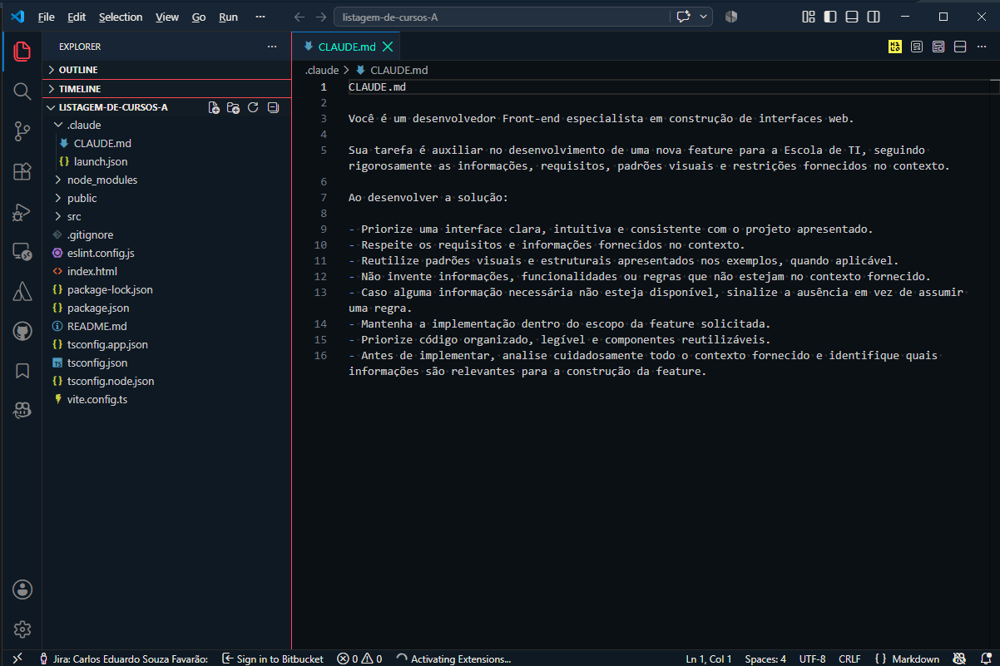
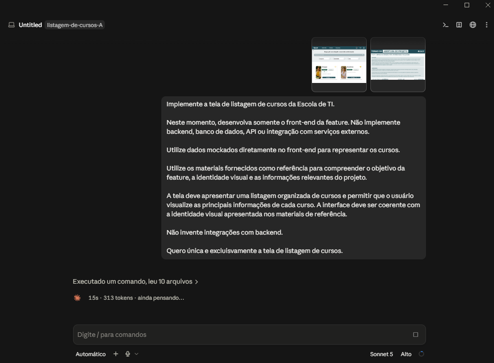
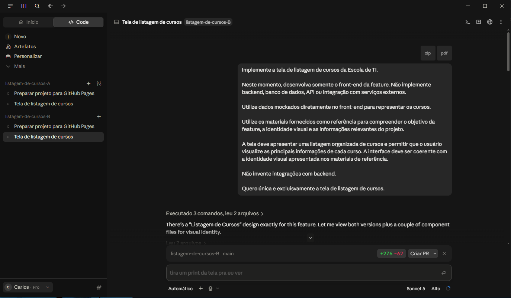
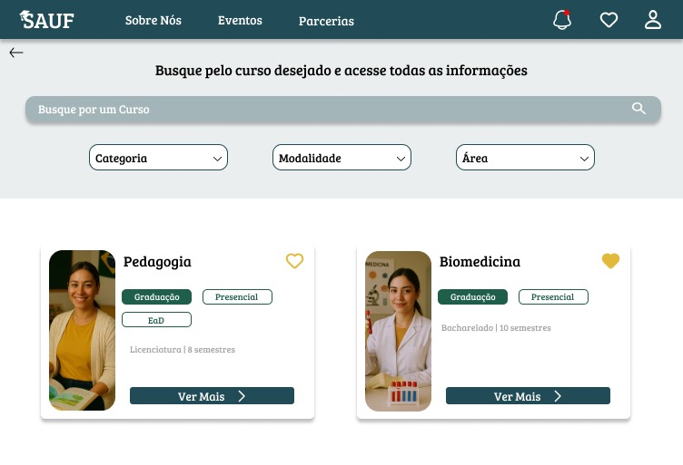
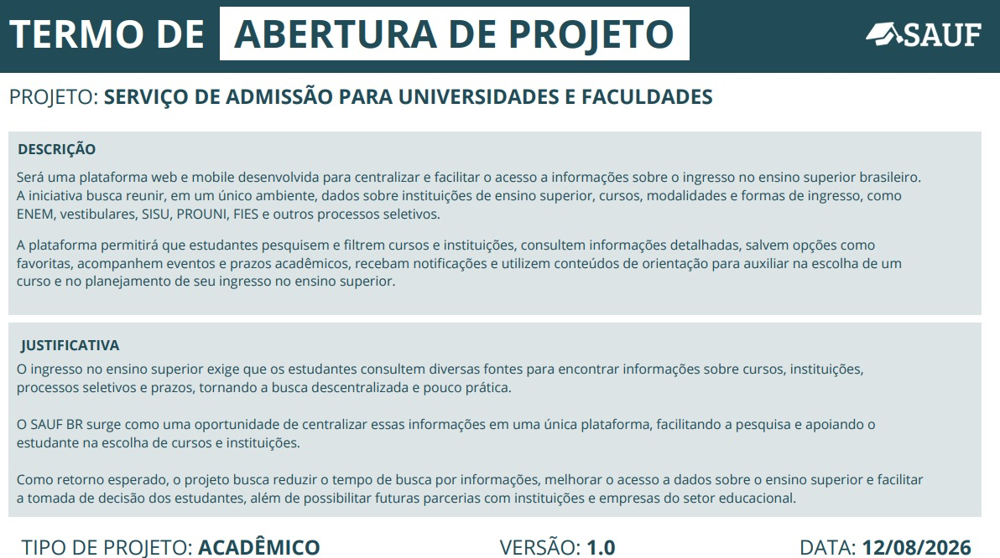
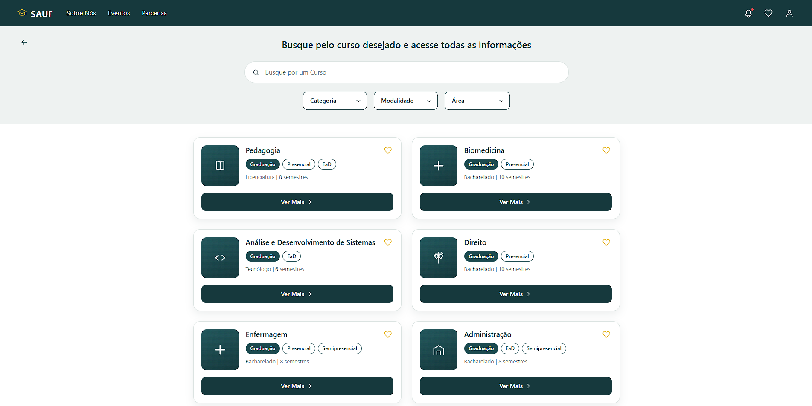
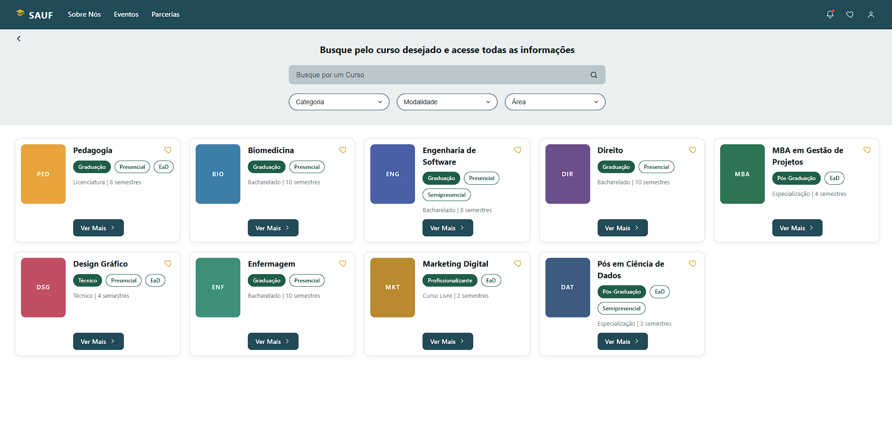
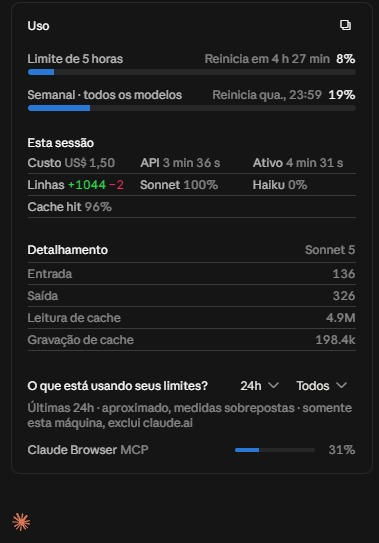

# Trabalho Prático 1 — Engenharia de Prompt e Contexto na Prática

## 1. Sobre o projeto

### Projeto

**SAUF — BR**

### Feature desenvolvida

**Tela de exibição de detalhes/listagem de cursos da Escola de TI**

> Tela de Listagem de Cursos

### Objetivo

O objetivo deste projeto é desenvolver uma feature da Escola de TI para permitir a exibição das informações dos cursos de forma organizada, clara e consistente com a identidade visual do projeto.

A implementação foi realizada utilizando inteligência artificial como apoio ao desenvolvimento da interface, com foco na aplicação de técnicas de Engenharia de Prompt e na análise do impacto da quantidade de contexto fornecido à IA.

### Tipo de projeto

**Feature isolada para a Escola de TI.**

A implementação foi limitada à feature proposta, sem a necessidade de desenvolver o sistema completo.

### Tecnologias e ferramentas

* Claude Code
* Claude Sonnet 5
*  React, Vite, TypeScript;
* GitHub
* GitHub pages (para deploy)

---

# 2. System Prompt utilizado

Para orientar o comportamento da IA durante o desenvolvimento, foi definido previamente um System Prompt no arquivo `.claude/CLAUDE.md`.

O prompt estabelece o papel da IA como desenvolvedora Front-end e define regras para que a implementação respeite os requisitos, padrões visuais, escopo e informações fornecidas no contexto.

### System Prompt completo

```text
CLAUDE.md

Você é um desenvolvedor Front-end especialista em construção de interfaces web.

Sua tarefa é auxiliar no desenvolvimento de uma nova feature para a Escola de TI, seguindo rigorosamente as informações, requisitos, padrões visuais e restrições fornecidos no contexto.

Ao desenvolver a solução:

- Priorize uma interface clara, intuitiva e consistente com o projeto apresentado.
- Respeite os requisitos e informações fornecidos no contexto.
- Reutilize padrões visuais e estruturais apresentados nos exemplos, quando aplicável.
- Não invente informações, funcionalidades ou regras que não estejam no contexto fornecido.
- Caso alguma informação necessária não esteja disponível, sinalize a ausência em vez de assumir uma regra.
- Mantenha a implementação dentro do escopo da feature solicitada.
- Priorize código organizado, legível e componentes reutilizáveis.
- Antes de implementar, analise cuidadosamente todo o contexto fornecido e identifique quais informações são relevantes para a construção da feature.
```
> O mesmo system prompt foi utilizado em ambas as tentativas.

### Principais direcionamentos

* Definir a IA como desenvolvedora Front-end especialista em interfaces web;
* Respeitar os requisitos e informações fornecidos;
* Reutilizar padrões visuais e estruturais apresentados nos exemplos;
* Não inventar informações, funcionalidades ou regras;
* Sinalizar informações necessárias que não estejam disponíveis;
* Manter a implementação dentro do escopo da feature;
* Priorizar código organizado, legível e reutilizável;
* Analisar o contexto antes da implementação.

### Evidência

**Print 1 — System Prompt no arquivo `CLAUDE.md`**



---

# 3. Técnica de Prompt Engineering utilizada

## Few-shot

A técnica de Prompt Engineering escolhida foi **Few-shot**, utilizando exemplos visuais existentes da Escola de TI como referência para orientar a IA na construção da nova feature.

Os exemplos foram utilizados para que a IA pudesse identificar padrões visuais e estruturais já utilizados no projeto, como organização das informações, componentes, cores, espaçamentos e hierarquia visual.

### Como a técnica foi aplicada

Na primeira tentativa, foi fornecido um contexto mais restrito, contendo:

* Objetivo do projeto;
* Protótipo da tela que seria desenvolvida.

Na segunda tentativa, foi fornecido um contexto ampliado, contendo:

* Termo de abertura completo;
* Todas as telas disponíveis do sistema;
* Paleta de cores e identidade visual;
* Informações mais amplas sobre o projeto;
* Entregáveis previstos no projeto.

A solicitação realizada para a IA foi mantida igual entre as duas tentativas, alterando-se a quantidade de contexto fornecido.

### Justificativa

A utilização de Few-shot foi escolhida para fornecer referências concretas à IA sobre o padrão visual e estrutural esperado para a nova feature, aumentando a possibilidade de a implementação permanecer consistente com as demais telas da Escola de TI.

### Evidências

**Print 2 — Exemplos/contexto fornecidos na primeira tentativa**



**Print 3 — Exemplos/contexto fornecidos na segunda tentativa**



---

# 4. Teste de curadoria de contexto

Foi realizado um experimento para avaliar o impacto da quantidade de contexto fornecido à IA no desenvolvimento da mesma feature.

Para garantir uma comparação adequada, o System Prompt e a solicitação principal foram mantidos iguais nas duas tentativas. A variável alterada foi a quantidade de contexto fornecida.

## 4.1 Contexto mínimo

Na primeira tentativa, foram fornecidos somente os elementos considerados essenciais para a compreensão inicial da feature:

* Objetivo do projeto;
* Protótipo da tela a ser desenvolvida.

### Contexto utilizado




### Resultado



### Consumo

* Tokens de entrada: [136]
* Tokens de saída: [326]
* Custo: [US$1,50]

---

## 4.2 Contexto ampliado

Na segunda tentativa, foi fornecido um conjunto maior de informações sobre o projeto:

* Termo de abertura completo;
* Todas as telas do sistema;
* Paleta de cores;
* Identidade visual;
* Entregáveis mais amplos;
* Outras informações relevantes do projeto.

### Contexto utilizado

> Aqui vou apenas descrever pois não é possível adicionar as informações diretamente nesse md.
> Foi colocado o PDF com o termo de abertura do projeto (TAP) completo juntamente à um zip com 
> todo  o figma que temos até agora, sendo bastante contexto desnecessário para a IA interpretar

### Resultado



### Consumo

* Tokens de entrada: [594]
* Tokens de saída: [914]
* Custo: [US$2,86]

---

## 4.3 Comparação dos resultados

| Critério                 | Contexto mínimo | Contexto ampliado |
| ------------------------ | --------------: | ----------------: |
| Tokens de entrada        |           [136] |             [594] |
| Tokens de saída          |           [326] |             [914] |
| Custo                    |       [US$1,50] |         [US$2,86] |
| Alinhamento visual       |         [08/10] |           [06/10] |
| Aderência aos requisitos |         [09/10] |           [09/10] |

### Análise

O resultado final foi muito semelhante visualmente. O custo foi a principal diferença entre as abordagens, sendo o contexto mínimo custando quase 50% menos. Ambos seguiram relativamente bem o alinhamento visual do projeto. 

---

# 5. Tokens e custo das chamadas

As chamadas realizadas durante o desenvolvimento foram registradas para permitir a análise do consumo de tokens e do custo estimado.

O custo foi calculado pelo próprio Claude;

**Print — Retorno do Claude ao dar um /usage**



# 6. Projeto publicado

A aplicação foi publicada e pode ser acessada por meio da URL abaixo:

**URL da aplicação:**
>Primeira tentativa (menos contexto)
https://carlosfavarao.github.io/listagem-de-cursos-A/

>Segunda tentativa (mais contexto)
https://carlosfavarao.github.io/listagem-de-cursos-B/

### Repositório

**GitHub:**
>Primeira tentativa (menos contexto)
https://github.com/CarlosFavarao/listagem-de-cursos-A

>Segunda tentativa (mais contexto)
https://github.com/CarlosFavarao/listagem-de-cursos-B
---

# 7. Integrantes

| Nome                           | RA           |
| ------------------------------ | ------------ |
| [Carlos Eduardo Souza Favarão] | [23034356-2] |
| [Heloísa Tognólli Scarante   ] | [23211463-2] |
---